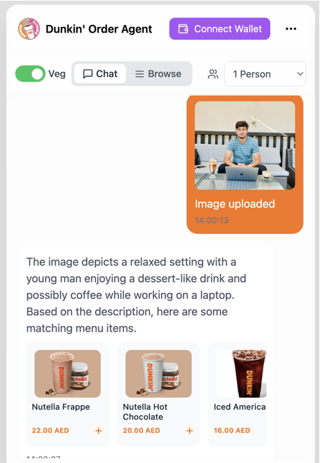

# Dunkin' Donuts AI Chatbot Demo

Welcome to the **Dunkin' Donuts Demo Chatbot**! This project showcases an AI-powered chatbot designed to assist users with menu navigation and ordering. The chatbot leverages OpenAI APIs to provide dynamic, contextual responses based on the Dunkin' Donuts menu.

## Features

- **Interactive Menu Navigation**: Explore Dunkin' Donuts menu categories and items easily.
- **AI-Powered Suggestions**: Get tailored recommendations based on your preferences.
- **JSON Output for Orders**: The chatbot generates structured JSON responses for seamless integration.
- **User-Friendly Design**: Built with a focus on accessibility and simplicity.

## Screenshots

### 1. **Chatbot Welcome Screen**



### 2. **Menu Display**


### 3. **Order Confirmation**


### 4. **AI Suggestions**


## Tech Stack

- **Frontend**: React.js, Material-UI
- **Backend**: Node.js, Express
- **AI Engine**: OpenAI API
- **Database**: JSON-based menu storage

## Getting Started

1. **Clone the repository**:
   ```bash
   git clone https://github.com/tahirahmadin/dunkin-demo.git
   cd dunkin-demo
   ```
